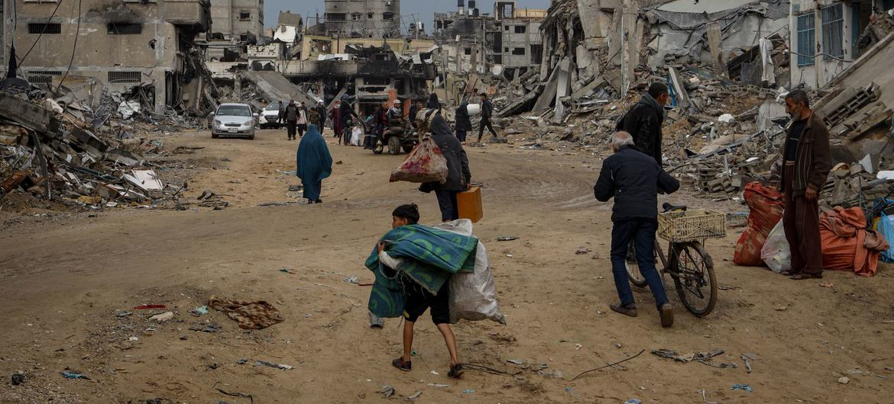

<h1>Conflicto en palestina:</h1>

### Subtítulo: Inicio del conflicto

##### Imágenes impactantes del territorio Palestino

> Por 138 votos contra 9 y 41 abstenciones, la Asamblea General aprobó una resolución por la que otorgó a Palestina la condición de Estado observador no miembro en las Naciones Unidas. Mahmoud Abbas (centro, primera fila), Presidente de la Autoridad Palestina, con su delegación en el Salón de la Asamblea General tras la decisión de la Asamblea. 29 de noviembre de 2012. Naciones Unidas, Nueva York. Foto ONU.

## Clave 1 para entender el conflicto de israel:
>La creación del Estado de Israel y el problema demográfico
El sionismo es un movimiento nacionalista que persigue la creación de un Estado judío y democrático en la Tierra Prometida del judaísmo, localizada en la Palestina histórica. Movidos por razones económicas, nacional-religiosas y humanitarias, los judíos comenzaron a emigrar hacia esta Tierra Prometida en 1881. La primera oleada judía a gran escala tuvo lugar en la década de 1930, en pleno Mandato Británico, como consecuencia de la persecución nazi.

>Con el paso de los años, las comunidades judías asentadas en la Palestina histórica fueron creciendo y, con ello, aumentaron los enfrentamientos entre los palestinos que reivindicaban la independencia y los judíos que consideraban ese territorio como propio. Ante este panorama, el Reino Unido acudió a Naciones Unidas en 1947, que emitió la Resolución 181 (II). Esta resolución dividió la región en dos Estados: uno árabe y otro judío. A este último se le asignó el 54% del territorio. A Jerusalén, ciudad clave para ambas culturas, se le asignó un estatus de “corpus separatum” bajo un régimen internacional.

## Clave 2: Las Guerras de 1948 y 1967
>En 1948, Israel ganó la Guerra de la Independencia y pasó a ocupar el 77% del territorio, incluido el oeste de Jerusalén. Bajo dominio egipcio quedó la Franja de Gaza y bajo dominio jordano, Cisjordania (incluido Jerusalén Este).

>Por un lado, Israel considera que las potencias árabes buscaban destruir el recién creado Estado de Israel. Algunos historiadores críticos consideran que las potencias árabes intervinieron para proteger a la población palestina, que ya antes de la independencia de Israel sufrió desplazamientos mediante planes de conquista militar israelíes como el Plan Dalet. Otros consideran que las potencias árabes vieron en el plan de partición de la ONU una nueva muestra de colonialismo occidental.